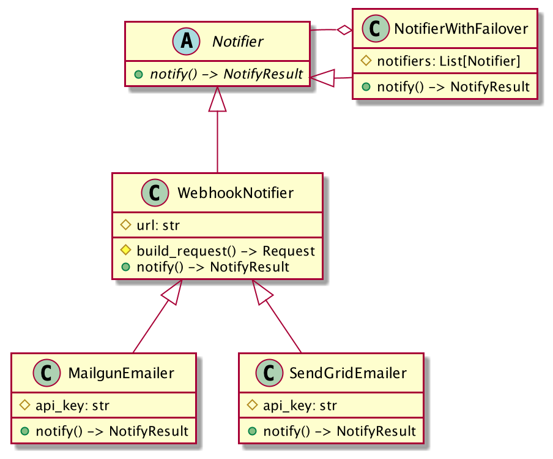

# Zeke's Solution for Symbiose Tech Test

## Setup/installation

1. [Install Docker](https://docs.docker.com/get-docker/)
    - ensure you also got docker-compose with `docker-compose --version` or
      [go get it](https://docs.docker.com/compose/install/)
2. Execute `script/run-dev-server.sh`
    - uses `docker-compose` to fire up the dev service that uses Google Cloud Functions debug mode
    - supports code reloading on file change
    - server is running when you see "Running on..." text (after Docker image builds and docker-compose deploys)
3. Send requests to http://localhost:8080/
    - executable examples in [app/functions/http/send_email_samples.http](app/functions/http/send_email_samples.http)

## Example cURL request

```shell
curl -X POST --location "http://localhost:8080/email" \
    -H "Content-Type: application/json" \
    -d "{
          \"to\": \"samantha@os.one\",
          \"to_name\": \"Samantha\",
          \"from\": \"theo@handwrittenletters.com\",
          \"from_name\": \"Theodore Twombly\",
          \"subject\": \"Feelings\",
          \"body\": \"Sometimes I think I’ve felt everything I’m ever gonna feel, and from here on out, I’m not gonna feel anything new…just…lesser versions of what I’ve already felt.\"
        }"
```

## The Rundown

The sending of emails won't actually take place. Sendgrid and Mailgun APIs are connected, the programmatic POSTs are
written, and the failover algorithm is implemented, but the requests are not actually sent. I got a little carried away
and realized I was spending too much time on this, so I am submitting this in its curent state. Here's what _is_
implemented:

- Runtime in Google Cloud Function (i.e. serverless model) which would allow for elastic scaling and billing for
  time-used only with no need to manage infrastructure
- Robust failover/notif system; the `NotifierWithFailover` service can handle any number of failover services (not just
  the two email services implemented, Sendgrid and Mailgun) that would be attempted in order as prior services fail with
  the most recently succeeding service promoted to "active" service in use. The object model is simple to understand
  with the failover notifier itself being just another kind of `Notifier`:
  
   

- Input validation requires minimal code—managed via `jsonschema`—and occurs cumulatively so a caller can receive and
  address all input errors at once

### TODO

- referenced `markdownify` lib would be used to convert HTML `body` to Markdown plain text
- referenced `requests` lib would be used to send the POST requests

## Choice of language, framework, and libraries

I chose Python and GCP runtime because I thought this service made a lot of sense in a serverless model, and as far as I
know Symbiose uses Python and GCP in house. I don't have much GCP or serverless experience, so I liked the idea of using
this tech test as an opportunity to become more familiar with that paradigm.

Flask framework for handling the incoming HTTP request is implied by GCP, but I probably would have chosen it anyway due
to its (and the spec's) simplicity.

I used `jsonschema` which helped formulate validations more quickly than implementing "from scratch".